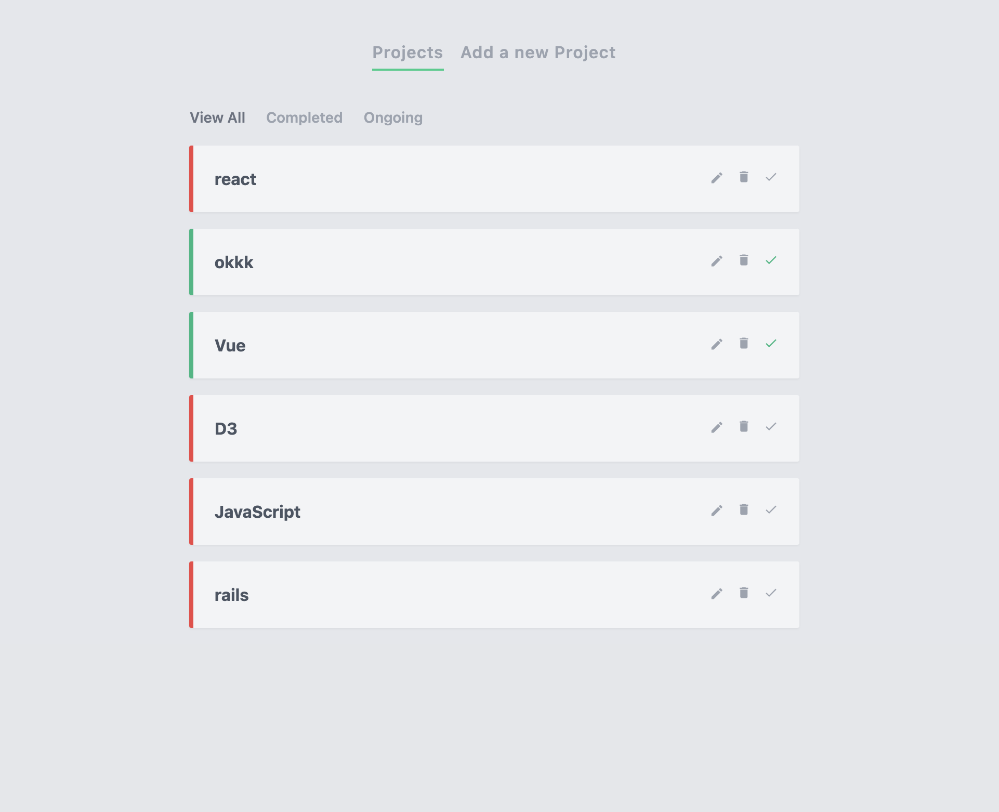
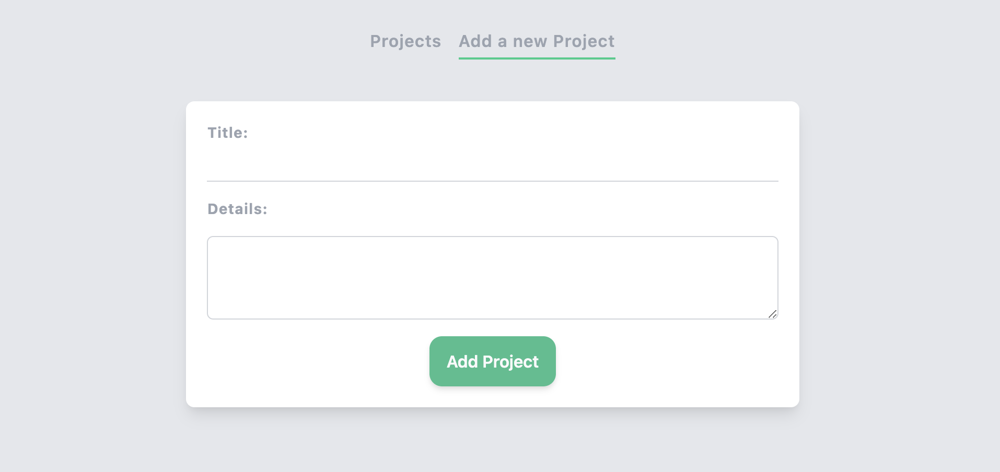

# blog-m
This is a project-manager created by Marshall

This web-app can lets user creat a project and keep track of all projects

## Technologies Used
- Generating using [Vue3] (https://v3.vuejs.org/)
- Using [Tailwindcss] for styling (https://tailwindcss.com/)
- [JavaScript] (https://developer.mozilla.org/en-US/docs/Web/JavaScript)

## NPM Used
- JSON server for virtual database (https://github.com/typicode/json-server)

## Features
As a User:
- I can create a project, see all the projects,edit a project, delete a project, change the status of a project

## Screenshot
Home:

Create:


## Setup
For Localhost

```
npm install
```
### Run the json-server
```
json-server --watch data/db.json
```

### Compiles and hot-reloads for development
```
npm run serve
```

## Structure

Virtual Dom Structure

Main entrance: ```src/App.vue```
               ```src/main.js```

Views are in the ```src/views ```

Components in the ```src/components```
  
router is in the ```src/router```